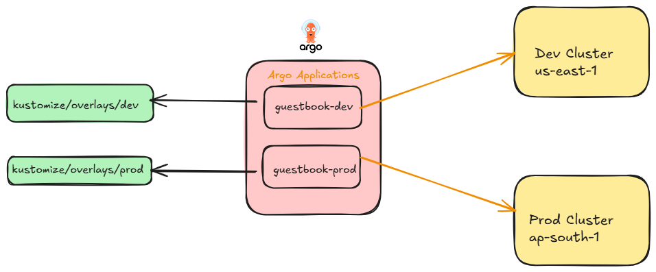

Agenda:

1. Multi cluster creation
2. Adding multiple clusters to ArgoCD
3. Application specification for multi cluster deployments
4. Kustomize
5. ApplicationSets
6. RBAC
7. Argo rollouts Rollback vs Git state


Helm and Analysis template - Ranjini


Cluster creation

```
# -------------------------------------------------------
# Providers
# -------------------------------------------------------
provider "aws" {
  region = "us-east-1"
  alias  = "us-east-1"
}

provider "aws" {
  region = "ap-south-1"
  alias  = "ap-south-1"
}

# -------------------------------------------------------
# DEV CLUSTER (us-east-1)
# -------------------------------------------------------

# Data sources
data "aws_vpc" "dev" {
  provider = aws.us-east-1
  default  = true
}

data "aws_subnets" "dev" {
  provider = aws.us-east-1

  filter {
    name   = "vpc-id"
    values = [data.aws_vpc.dev.id]
  }

  filter {
    name   = "availability-zone"
    values = ["us-east-1a", "us-east-1b"]
  }
}

# IAM Role for EKS Cluster
resource "aws_iam_role" "dev_eks_cluster_role" {
  name     = "dev-eks-cluster-role"
  provider = aws.us-east-1

  assume_role_policy = jsonencode({
    Version = "2012-10-17"
    Statement = [
      {
        Action = "sts:AssumeRole"
        Effect = "Allow"
        Principal = {
          Service = "eks.amazonaws.com"
        }
      }
    ]
  })
}

resource "aws_iam_role_policy_attachment" "dev_eks_cluster_policy" {
  provider   = aws.us-east-1
  policy_arn = "arn:aws:iam::aws:policy/AmazonEKSClusterPolicy"
  role       = aws_iam_role.dev_eks_cluster_role.name
}

# EKS Cluster
resource "aws_eks_cluster" "dev" {
  name     = "dev-argocd-cluster"
  provider = aws.us-east-1
  role_arn = aws_iam_role.dev_eks_cluster_role.arn

  vpc_config {
    subnet_ids = data.aws_subnets.dev.ids
  }

  depends_on = [
    aws_iam_role_policy_attachment.dev_eks_cluster_policy
  ]
}

# IAM Role for Node Group
resource "aws_iam_role" "dev_eks_node_group_role" {
  name     = "dev-eks-node-group-role"
  provider = aws.us-east-1

  assume_role_policy = jsonencode({
    Version = "2012-10-17"
    Statement = [
      {
        Action = "sts:AssumeRole"
        Effect = "Allow"
        Principal = {
          Service = "ec2.amazonaws.com"
        }
      }
    ]
  })
}

resource "aws_iam_role_policy_attachment" "dev_eks_worker_node_policy" {
  provider   = aws.us-east-1
  policy_arn = "arn:aws:iam::aws:policy/AmazonEKSWorkerNodePolicy"
  role       = aws_iam_role.dev_eks_node_group_role.name
}

resource "aws_iam_role_policy_attachment" "dev_eks_cni_policy" {
  provider   = aws.us-east-1
  policy_arn = "arn:aws:iam::aws:policy/AmazonEKS_CNI_Policy"
  role       = aws_iam_role.dev_eks_node_group_role.name
}

resource "aws_iam_role_policy_attachment" "dev_ec2_container_registry_readonly" {
  provider   = aws.us-east-1
  policy_arn = "arn:aws:iam::aws:policy/AmazonEC2ContainerRegistryReadOnly"
  role       = aws_iam_role.dev_eks_node_group_role.name
}

# Node Group
resource "aws_eks_node_group" "dev" {
  provider        = aws.us-east-1
  cluster_name    = aws_eks_cluster.dev.name
  node_group_name = "dev-node-group"
  node_role_arn   = aws_iam_role.dev_eks_node_group_role.arn
  subnet_ids      = data.aws_subnets.dev.ids

  scaling_config {
    desired_size = 1
    max_size     = 3
    min_size     = 1
  }

  instance_types = ["t3.medium"]

  depends_on = [
    aws_iam_role_policy_attachment.dev_eks_worker_node_policy,
    aws_iam_role_policy_attachment.dev_eks_cni_policy,
    aws_iam_role_policy_attachment.dev_ec2_container_registry_readonly
  ]
}

# -------------------------------------------------------
# PROD CLUSTER (ap-south-1)
# -------------------------------------------------------

# Data sources
data "aws_vpc" "prod" {
  provider = aws.ap-south-1
  default  = true
}

data "aws_subnets" "prod" {
  provider = aws.ap-south-1

  filter {
    name   = "vpc-id"
    values = [data.aws_vpc.prod.id]
  }

  filter {
    name   = "availability-zone"
    values = ["ap-south-1a", "ap-south-1b"]
  }
}

# IAM Role for EKS Cluster
resource "aws_iam_role" "prod_eks_cluster_role" {
  name     = "prod-eks-cluster-role"
  provider = aws.ap-south-1

  assume_role_policy = jsonencode({
    Version = "2012-10-17"
    Statement = [
      {
        Action = "sts:AssumeRole"
        Effect = "Allow"
        Principal = {
          Service = "eks.amazonaws.com"
        }
      }
    ]
  })
}

resource "aws_iam_role_policy_attachment" "prod_eks_cluster_policy" {
  provider   = aws.ap-south-1
  policy_arn = "arn:aws:iam::aws:policy/AmazonEKSClusterPolicy"
  role       = aws_iam_role.prod_eks_cluster_role.name
}

# EKS Cluster
resource "aws_eks_cluster" "prod" {
  name     = "prod-argocd-cluster"
  provider = aws.ap-south-1
  role_arn = aws_iam_role.prod_eks_cluster_role.arn

  vpc_config {
    subnet_ids = data.aws_subnets.prod.ids
  }

  depends_on = [
    aws_iam_role_policy_attachment.prod_eks_cluster_policy
  ]
}

# IAM Role for Node Group
resource "aws_iam_role" "prod_eks_node_group_role" {
  name     = "prod-eks-node-group-role"
  provider = aws.ap-south-1

  assume_role_policy = jsonencode({
    Version = "2012-10-17"
    Statement = [
      {
        Action = "sts:AssumeRole"
        Effect = "Allow"
        Principal = {
          Service = "ec2.amazonaws.com"
        }
      }
    ]
  })
}

resource "aws_iam_role_policy_attachment" "prod_eks_worker_node_policy" {
  provider   = aws.ap-south-1
  policy_arn = "arn:aws:iam::aws:policy/AmazonEKSWorkerNodePolicy"
  role       = aws_iam_role.prod_eks_node_group_role.name
}

resource "aws_iam_role_policy_attachment" "prod_eks_cni_policy" {
  provider   = aws.ap-south-1
  policy_arn = "arn:aws:iam::aws:policy/AmazonEKS_CNI_Policy"
  role       = aws_iam_role.prod_eks_node_group_role.name
}

resource "aws_iam_role_policy_attachment" "prod_ec2_container_registry_readonly" {
  provider   = aws.ap-south-1
  policy_arn = "arn:aws:iam::aws:policy/AmazonEC2ContainerRegistryReadOnly"
  role       = aws_iam_role.prod_eks_node_group_role.name
}

# Node Group
resource "aws_eks_node_group" "prod" {
  provider        = aws.ap-south-1
  cluster_name    = aws_eks_cluster.prod.name
  node_group_name = "prod-node-group"
  node_role_arn   = aws_iam_role.prod_eks_node_group_role.arn
  subnet_ids      = data.aws_subnets.prod.ids

  scaling_config {
    desired_size = 1
    max_size     = 4
    min_size     = 1
  }

  instance_types = ["t3.medium"]

  depends_on = [
    aws_iam_role_policy_attachment.prod_eks_worker_node_policy,
    aws_iam_role_policy_attachment.prod_eks_cni_policy,
    aws_iam_role_policy_attachment.prod_ec2_container_registry_readonly
  ]
}

# -------------------------------------------------------
# Outputs
# -------------------------------------------------------
output "dev_cluster_endpoint" {
  value = aws_eks_cluster.dev.endpoint
}

output "dev_cluster_name" {
  value = aws_eks_cluster.dev.name
}

output "prod_cluster_endpoint" {
  value = aws_eks_cluster.prod.endpoint
}

output "prod_cluster_name" {
  value = aws_eks_cluster.prod.name
}
```

Create the infra using terraform
```
terraform init
terraform apply --auto-approve
```

Note down the outputs we get like this
```
Outputs:

dev_cluster_endpoint = "https://1440EF309B7D8B599579E7FFC69D84F2.gr7.us-east-1.eks.amazonaws.com"
dev_cluster_name = "dev-argocd-cluster"
prod_cluster_endpoint = "https://A62F1AB01F99B8668087E1A776089FE2.yl4.ap-south-1.eks.amazonaws.com"
prod_cluster_name = "prod-argocd-cluster"
```

Get the kubeconfig of both the clusters
```
aws eks update-kubeconfig --region us-east-1 --name dev-argocd-cluster
kubectl get nodes -A
aws eks update-kubeconfig --region ap-south-1 --name prod-argocd-cluster
kubectl get nodes -A
```

Make sure your context is set to dev cluster
```
kubectl config get-contexts
```

Install ArgoCD in dev cluster
```
kubectl create namespace argocd
kubectl apply -n argocd -f https://raw.githubusercontent.com/argoproj/argo-cd/stable/manifests/install.yaml
kubectl port-forward svc/argocd-server -n argocd 8080:443
kubectl get secret argocd-initial-admin-secret -n argocd -o jsonpath="{.data.password}" | base64 -d; echo
```

```
windows:
kubectl get secret argocd-initial-admin-secret -n argocd -o jsonpath="{.data.password}" |
ForEach-Object { [System.Text.Encoding]::UTF8.GetString([System.Convert]::FromBase64String($_)) }
```

Install ArgoRollouts in both the clusters(dev and prod)
```
kubectl create namespace argo-rollouts
kubectl apply -n argo-rollouts -f https://github.com/argoproj/argo-rollouts/releases/latest/download/install.yaml
curl -LO https://github.com/argoproj/argo-rollouts/releases/latest/download/kubectl-argo-rollouts-linux-amd64
sudo mv kubectl-argo-rollouts-linux-amd64 /usr/local/bin/kubectl-argo-rollouts
sudo chmod +x /usr/local/bin/kubectl-argo-rollouts
```

Note: since we are using rollout objects, it's custom controller has to be available in both the clusters

Install ingress controllers in both the clusters
```
kubectl apply -f https://raw.githubusercontent.com/kubernetes/ingress-nginx/controller-v1.10.0/deploy/static/provider/aws/deploy.yaml
```

ArgoCLI login
```
$ argocd login localhost:8080 --username admin  --password gaSkGcZsc0G5xIzW
WARNING: server certificate had error: tls: failed to verify certificate: x509: certificate signed by unknown authority. Proceed insecurely (y/n)? y
'admin:login' logged in successfully
Context 'localhost:8080' updated

Get password from `kubectl get secret argocd-initial-admin-secret -n argocd -o jsonpath="{.data.password}" | base64 -d; echo`
```

```
$ argocd cluster list
$ argocd cluster add arn:aws:eks:us-east-1:020930354342:cluster/dev-argocd-cluster

$ argocd cluster add arn:aws:eks:ap-south-1:020930354342:cluster/prod-argocd-cluster
WARNING: This will create a service account `argocd-manager` on the cluster referenced by context `arn:aws:eks:ap-south-1:020930354342:cluster/prod-argocd-cluster` with full cluster level privileges. Do you want to continue [y/N]? y
{"level":"info","msg":"ServiceAccount \"argocd-manager\" created in namespace \"kube-system\"","time":"2025-11-04T18:29:49+05:30"}
{"level":"info","msg":"ClusterRole \"argocd-manager-role\" created","time":"2025-11-04T18:29:49+05:30"}
{"level":"info","msg":"ClusterRoleBinding \"argocd-manager-role-binding\" created","time":"2025-11-04T18:29:49+05:30"}
{"level":"info","msg":"Created bearer token secret \"argocd-manager-long-lived-token\" for ServiceAccount \"argocd-manager\"","time":"2025-11-04T18:29:49+05:30"}
Cluster 'https://A62F1AB01F99B8668087E1A776089FE2.yl4.ap-south-1.eks.amazonaws.com' added


$ argocd cluster list
SERVER                                                                     NAME                                                             VERSION  STATUS   MESSAGE                                                  PROJECT
https://A62F1AB01F99B8668087E1A776089FE2.yl4.ap-south-1.eks.amazonaws.com  arn:aws:eks:ap-south-1:020930354342:cluster/prod-argocd-cluster           Unknown  Cluster has no applications and is not being monitored.  
https://1440EF309B7D8B599579E7FFC69D84F2.gr7.us-east-1.eks.amazonaws.com   arn:aws:eks:us-east-1:020930354342:cluster/dev-argocd-cluster             Unknown  Cluster has no applications and is not being monitored.  
https://kubernetes.default.svc                                             in-cluster                                                                Unknown  Cluster has no applications and is not being monitored.  
```

Helm and Kustomize for managing multiple environments

Why: Reducing duplication in code. Same manifest files with only values passing based on the environment

In terms of Helm:

Modify the manifest file as Helm charts and keep it in the manifest repo
Create values.yaml based on dev and prod
Pass it in the application manifest

In terms of Kustomize:

Use the same k8s native manifest files
create a kustomization.yaml file where apply only patches wherever changes required based on the environment.
For eg: replica differs for dev and prod, its 2 and 4 respectively. We apply patch only for replica in kustomization.yaml file


##Kustomize:

base - contain original k8s manifest files 
overlays - environment specific variables




Create Argoapplications

argo-applications/project.yaml
```
apiVersion: argoproj.io/v1alpha1
kind: AppProject
metadata:
  name: guestbook
  namespace: argocd
spec:
  description: Project for test repo with all clusters and namespaces allowed
  sourceRepos:
    - https://github.com/crazylearning-cr/argo-multi-cluster-deployments.git
  destinations:
    # ✅ Dev-Cluster (us-east-1)
    - namespace: '*'
      server: https://26FCF9DA4ACDE97CFFA0688F62D86021.gr7.us-east-1.eks.amazonaws.com
    - namespace: '*'
      server: https://D25809CD9BA2111831BEEE33CFFEB9AF.gr7.ap-south-1.eks.amazonaws.com
  # Allow creating Namespaces and all namespaced resources
  clusterResourceWhitelist:
    - group: ""
      kind: Namespace
  namespaceResourceWhitelist:
    - group: "*"
      kind: "*"
```

argo-applications/application.yaml
```
apiVersion: argoproj.io/v1alpha1
kind: Application
metadata:
  name: guestbook-dev
  namespace: argocd
spec:
  project: guestbook
  source:
    repoURL: 'https://github.com/crazylearning-cr/argo-multi-cluster-deployments.git'
    targetRevision: main
    path: kustomize/overlays/dev
  destination:
    server: https://26FCF9DA4ACDE97CFFA0688F62D86021.gr7.us-east-1.eks.amazonaws.com
    namespace: dev
  syncPolicy:
    automated:
      prune: true
      selfHeal: true
    syncOptions:
      - CreateNamespace=true
---
apiVersion: argoproj.io/v1alpha1
kind: Application
metadata:
  name: guestbook-prod
  namespace: argocd
spec:
  project: guestbook
  source:
    repoURL: 'https://github.com/crazylearning-cr/argo-multi-cluster-deployments.git'
    targetRevision: main
    path: kustomize/overlays/prod
  destination:
    server: https://D25809CD9BA2111831BEEE33CFFEB9AF.gr7.ap-south-1.eks.amazonaws.com
    namespace: prod
  syncPolicy:
    automated:
      prune: true
      selfHeal: true
    syncOptions:
      - CreateNamespace=true
```

```
kubectl apply -f argo-applications/project.yaml
kubectl apply -f argo-applications/application.yaml
```

kustomize/base/rollout.yaml
```apiVersion: argoproj.io/v1alpha1
kind: Rollout
metadata:
  name: guestbook-ui
spec:
  replicas: 3
  revisionHistoryLimit: 2
  selector:
    matchLabels:
      app: guestbook-ui
  template:
    metadata:
      labels:
        app: guestbook-ui
    spec:
      containers:
        - name: guestbook-ui
          image: udemykcloud534/guestbook:yellow
          ports:
            - containerPort: 8080
          readinessProbe:
            httpGet:
              path: /
              port: 8080
            initialDelaySeconds: 5
            periodSeconds: 10
          livenessProbe:
            httpGet:
              path: /
              port: 8080
            initialDelaySeconds: 10
            periodSeconds: 20
          resources:
            requests:
              cpu: "100m"
              memory: "128Mi"
            limits:
              cpu: "500m"
              memory: "256Mi"
  strategy:
    canary:
      steps:
        # 1) Start some canary pods, but DON'T send prod traffic yet
        - setCanaryScale:
            replicas: 1

        # 2) Pause so testers can hit /preview (canary only)
        - pause: {}

        # 3) Now start shifting prod traffic
        - setWeight: 20
        - pause: {}

        - setWeight: 50
        - pause: {}

        - setWeight: 100
      canaryService: guestbook-ui-canary
      stableService: guestbook-ui
      trafficRouting:
        nginx:
          stableIngress: guestbook-ui-ingress
---
apiVersion: v1
kind: Service
metadata:
  name: guestbook-ui
spec:
  ports:
    - port: 80
      targetPort: 8080
  selector:
    app: guestbook-ui
---
apiVersion: v1
kind: Service
metadata:
  name: guestbook-ui-canary
spec:
  ports:
    - port: 80
      targetPort: 8080
  selector:
    app: guestbook-ui
---
# Main ingress used by Argo Rollouts for weighted traffic
apiVersion: networking.k8s.io/v1
kind: Ingress
metadata:
  name: guestbook-ui-ingress
  annotations:
    nginx.ingress.kubernetes.io/canary: "false"
    kubernetes.io/ingress.class: "nginx"
spec:
  ingressClassName: nginx
  rules:
    - http:
        paths:
          - path: /
            pathType: Prefix
            backend:
              service:
                name: guestbook-ui
                port:
                  number: 80
```

kustomize/base/kustomization.yaml
```
resources:
  - rollout.yaml
```

kustomize/overlays/dev/kustomization.yaml
```
resources:
  - ../../base

patches:
  - target:
      kind: Rollout
      name: guestbook-ui
    patch: |-
      - op: replace
        path: /spec/replicas
        value: 1
      
images:
  - name: udemykcloud534/guestbook
    newTag: blue
```


kustomize/overlays/prod/kustomization.yaml
```
resources:
  - ../../base

patches:
  - target:
      kind: Rollout
      name: guestbook-ui
    patch: |-
      - op: replace
        path: /spec/replicas
        value: 2

images:
  - name: udemykcloud534/guestbook
    newTag: yellow
```
Promote to next level
```
kubectl argo rollouts promote guestbook-ui -n dev


##Helm

Create Argo applications with helm values

argo-applications/dev.yaml

```
apiVersion: argoproj.io/v1alpha1
kind: Application
metadata:
  name: guestbook-dev
  namespace: argocd
spec:
  project: guestbook
  source:
    repoURL: 'https://github.com/udemykcloud/Argocd.git'
    targetRevision: main
    path: section6/guestbook/helm
    helm:
      valueFiles:
        - values-dev.yaml
  destination:
    server: https://1440EF309B7D8B599579E7FFC69D84F2.gr7.us-east-1.eks.amazonaws.com
    namespace: dev
  syncPolicy:
    automated:
      prune: true
      selfHeal: true
    syncOptions:
      - CreateNamespace=true
```

argo-applications/prod.yaml
```
apiVersion: argoproj.io/v1alpha1
kind: Application
metadata:
  name: guestbook-prod
  namespace: argocd
spec:
  project: guestbook
  source:
    repoURL: 'https://github.com/udemykcloud/Argocd.git'
    targetRevision: main
    path: section6/guestbook/helm
    helm:
      valueFiles:
        - values-prod.yaml
  destination:
    server: https://A62F1AB01F99B8668087E1A776089FE2.yl4.ap-south-1.eks.amazonaws.com
    namespace: prod
  syncPolicy:
    automated:
      prune: true
      selfHeal: true
    syncOptions:
      - CreateNamespace=true
```

Modify the k8s manifest files as helm charts. Its available under templates section6/guestbook/helm/templates/rollout.yaml
```
apiVersion: argoproj.io/v1alpha1
kind: Rollout
metadata:
  name: {{ include "guestbook-ui.fullname" . }}
spec:
  replicas: {{ .Values.replicaCount }}
  revisionHistoryLimit: 3
  selector:
    matchLabels:
      app: {{ include "guestbook-ui.name" . }}
  template:
    metadata:
      labels:
        app: {{ include "guestbook-ui.name" . }}
    spec:
      containers:
        - name: {{ include "guestbook-ui.name" . }}
          image: "{{ .Values.image.repository }}:{{ .Values.image.tag }}"
          ports:
            - containerPort: 80
  strategy:
    canary:
      stableService: {{ include "guestbook-ui.fullname" . }}
      canaryService: {{ include "guestbook-ui.fullname" . }}-canary
      steps:
        - setWeight: 50
        - pause: { duration: 30s }
        - setWeight: 100
```

section6/guestbook/helm/templates/service.yaml
```
apiVersion: v1
kind: Service
metadata:
  name: {{ include "guestbook-ui.fullname" . }}
spec:
  ports:
    - port: 80
      targetPort: 80
  selector:
    app: {{ include "guestbook-ui.name" . }}
---
apiVersion: v1
kind: Service
metadata:
  name: {{ include "guestbook-ui.fullname" . }}-canary
spec:
  ports:
    - port: 80
      targetPort: 80
  selector:
    app: {{ include "guestbook-ui.name" . }}
```

section6/guestbook/helm/templates/_helpers.tpl
```
{{- define "guestbook-ui.name" -}}
guestbook-ui
{{- end -}}

{{- define "guestbook-ui.fullname" -}}
{{ include "guestbook-ui.name" . }}
{{- end -}}
```

section6/guestbook/helm/values-dev.yaml

```
replicaCount: 1

image:
  repository: udemykcloud534/guestbook
  tag: green
```

values-prod.yaml
```
replicaCount: 2

image:
  repository: udemykcloud534/guestbook
  tag: green
```

section6/guestbook/helm/Chart.yaml
```
apiVersion: v2
name: guestbook-ui
description: Helm chart for guestbook-ui rollout using Argo Rollouts
type: application
version: 0.1.0
appVersion: "1.0.0"
```

Understanding Applicationsets


Apply the cluster ARN in the project and Application.yaml files

Create Argo Applications
```
apiVersion: argoproj.io/v1alpha1
kind: AppProject
metadata:
  name: guestbook
  namespace: argocd
spec:
  description: Project for test repo with all clusters and namespaces allowed
  sourceRepos:
    - https://github.com/udemykcloud/Argocd.git
  destinations:
    # ✅ Dev-Cluster (us-east-1)
    - namespace: '*'
      server: https://1440EF309B7D8B599579E7FFC69D84F2.gr7.us-east-1.eks.amazonaws.com
    - namespace: '*'
      server: https://A62F1AB01F99B8668087E1A776089FE2.yl4.ap-south-1.eks.amazonaws.com
  # Allow creating Namespaces and all namespaced resources
  clusterResourceWhitelist:
    - group: ""
      kind: Namespace
  namespaceResourceWhitelist:
    - group: "*"
      kind: "*"
```

Guestbook Argo Application deploy into dev cluster and prod cluster:
```
apiVersion: argoproj.io/v1alpha1
kind: Application
metadata:
  name: guestbook-dev
  namespace: argocd
spec:
  project: guestbook
  source:
    repoURL: 'https://github.com/udemykcloud/Argocd.git'
    targetRevision: main
    path: section6/guestbook/base
  destination:
    server: https://1440EF309B7D8B599579E7FFC69D84F2.gr7.us-east-1.eks.amazonaws.com
    namespace: dev
  syncPolicy:
    automated:
      prune: true
      selfHeal: true
    syncOptions:
      - CreateNamespace=true
---
apiVersion: argoproj.io/v1alpha1
kind: Application
metadata:
  name: guestbook-prod
  namespace: argocd
spec:
  project: guestbook
  source:
    repoURL: 'https://github.com/udemykcloud/Argocd.git'
    targetRevision: main
    path: section6/guestbook/base
  destination:
    server: https://A62F1AB01F99B8668087E1A776089FE2.yl4.ap-south-1.eks.amazonaws.com
    namespace: prod
  syncPolicy:
    automated:
      prune: true
      selfHeal: true
    syncOptions:
      - CreateNamespace=true
```

Using ApplicationSets
Replace multiple Application YAMLs like: guestbook-dev, guestbook-prod, moderator-dev,moderator-prod

with a single ApplicationSet that dynamically creates all these apps.
```
apiVersion: argoproj.io/v1alpha1
kind: ApplicationSet
metadata:
  name: guestbook-and-moderator
  namespace: argocd
spec:
  generators:
    - list:
        elements:
          # ---- Dev Cluster ----
          - appName: guestbook
            environment: dev
            clusterServer: https://1440EF309B7D8B599579E7FFC69D84F2.gr7.us-east-1.eks.amazonaws.com
            path: section6/guestbook/base


          # ---- Prod Cluster ----
          - appName: guestbook
            environment: prod
            clusterServer: https://A62F1AB01F99B8668087E1A776089FE2.yl4.ap-south-1.eks.amazonaws.com
            path: section6/guestbook/base

  template:
    metadata:
      name: '{{appName}}-{{environment}}'
      namespace: argocd
    spec:
      project: guestbook
      source:
        repoURL: 'https://github.com/udemykcloud/Argocd.git'
        targetRevision: main
        path: '{{path}}'
      destination:
        server: '{{clusterServer}}'
        namespace: '{{environment}}'
      syncPolicy:
        automated:
          prune: true
          selfHeal: true
        syncOptions:
          - CreateNamespace=true
```

